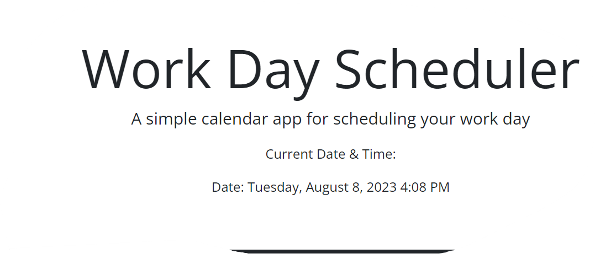
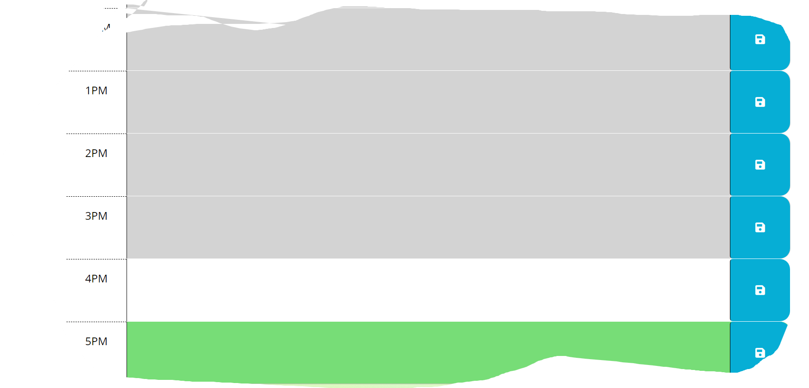

## Scheduling-Your-Workday

### Description
Scheduling Your Workday is an easy application to use(if I could get the local storage to work). This app can be very useful to people who have a busy schedual.  It is easy to add reminders and one day alerts to the app. Given more time(and knowledge) I would add an alert message that the user would set up, or have one as a default if they did not chose one, set for a specific time before their new event(scheudaled reminder)was to take place. That way they would never be late for meetings, appointments, family functions, or school activities for their children.  As I said, this can be a very useful app. I googled, YouTubed, read documentation about local stoage from all sorts of outlets and still can not get it to work. I also spent hours and hours trying to figure out onclick methods or addEventListeners, but I could not figure it out. There are alot of problems with this code. I do know.  I'm almost got it and that makes it very frustrating! I feel like I am almost at a huge breakthrough but fall short... for now. I will figure this out! My motivation for this app is quite simple... it would absolutly help me organize my person life and my professional life. I currently work in the hospitality industry and at any given time I have 20 differnet coworkers. They come and go. But in order to make them all feel appreciated I would like an app of some sort to remember their birthdays. Everyone deserves to feel special and appreciated on their birthday.  

### Table of Contents
N/A

### Installation
N/A

### Usage

My deployed site
https://saragar710.github.io/Scheduling-Your-Workday/

Some screenshots of the website

I reached out to a tutor for this assignment as well as a few TA's in class. I used Google, YouTube, W3Schools, and Mozilla.

### License
Please refer to the github repo.